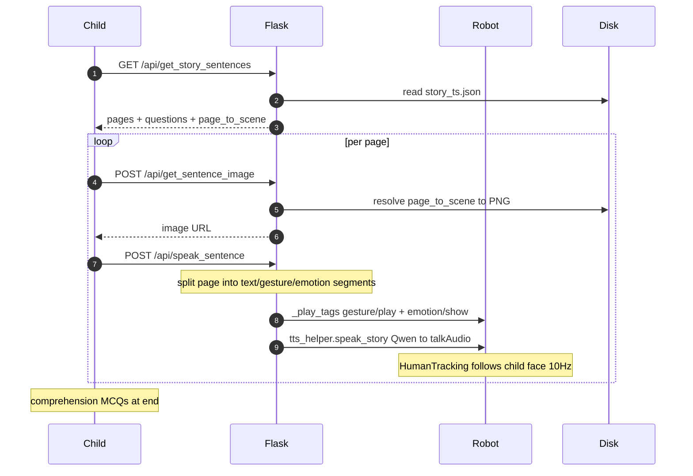
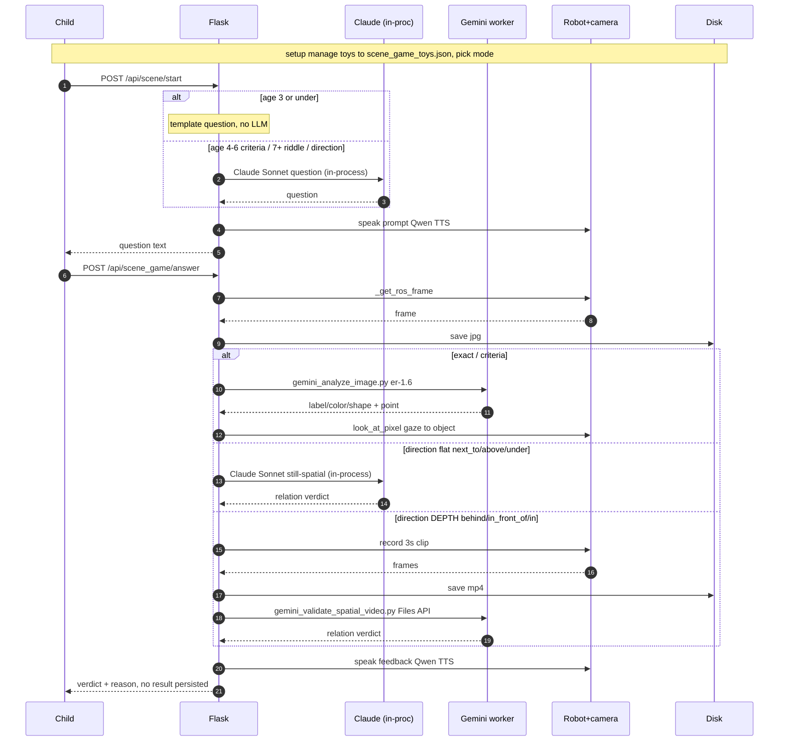
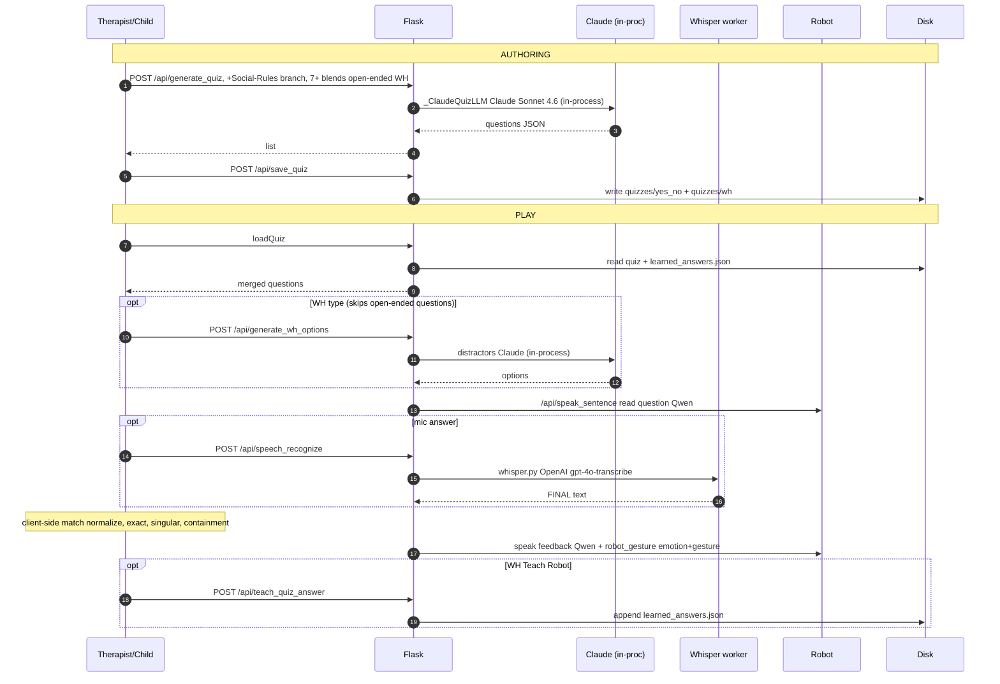
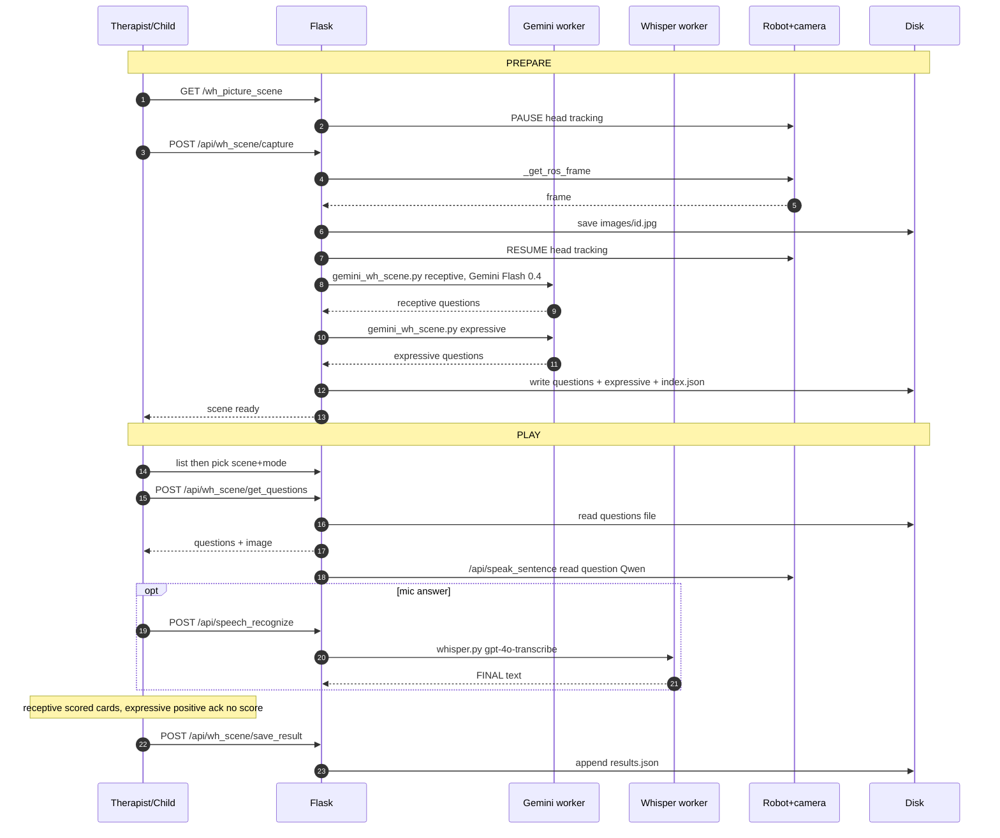

# QTrobot — System Architecture

> Regenerated 2026-06-17 from a direct read of the source tree; **model wiring
> re-verified and revised 2026-06-29** (see the changelog at the end of §15).
> File/line references point at the code in `src/`, `scripts/`, `config/`,
> `documents/`, and `templates/`. Line numbers drift as the ~7k-line server
> grows; refs in the model-related sections were refreshed on 2026-06-29, others
> may be approximate.
>
> **2026-06-29 headline change:** the quiz, the scene-game text (question/
> hint/criteria), and the still-frame spatial validation moved off Gemini Flash
> onto **Claude Sonnet 4.6, run in-process** via the Anthropic SDK. Gemini now
> covers only the story post-passes, the WH-picture & object-detection vision,
> depth-video validation, image generation, and conversation/recovery.

---

## 1. Overview

This folder contains **two independent applications** that happen to share a
small set of library modules. They have separate entry points, separate speech
stacks, and separate LLM wiring, and **neither imports the other**:

| | App A — Robot Assistant | App B — Web Game Platform |
|---|---|---|
| Entry point | `src/qt_ai_data_assistant.py` | `src/web_user_server.py` (6.5k lines) |
| How it runs | ROS node, autostarted (`scripts/autostart/`) | `python3 web_user_server.py`, Flask on `:8080` |
| Audience | End user talking to the robot | Therapist/clinician in a browser + child via robot |
| ASR | NVIDIA Riva + Silero VAD | `whisper.py` subprocess (OpenAI `gpt-4o-transcribe`) |
| Conversational LLM | Claude `claude-sonnet-4-6` via LlamaIndex (+ RAG) | Claude `claude-sonnet-4-6` in-process (quiz, scene-game text, still-spatial, intent) + Gemini subprocesses (story post-passes, vision, images) |
| TTS | Robot built-in voice (ROS `behavior/talkText`) | `tts_helper` (Qwen / Polly / QT) |
| Vision | DeepFace (face detect + re-ID) | Gemini vision scripts on camera frames |
| Config | `config/default.yaml` via ParamifyWeb | env vars + on-disk JSON |

**The directory name (`version_1_llm_gemini`) is misleading — more so since the
2026-06-29 migration.** App A's conversational model defaults to **Anthropic
Claude**, its embeddings are **local Ollama**, its ASR is **NVIDIA Riva**, and
its TTS is the **robot's own voice**. In App B, **Claude now does the bulk of
the language and still-image reasoning** (story, quiz, scene-game text,
still-frame spatial validation, ASR intent-correction). Gemini remains for the
story post-passes, the WH-picture / object-detection vision, depth-video
validation, image generation, and conversation/recovery follow-ups.

### The subprocess pattern (important) — and the in-process exception

Historically the servers ran under a ROS Python that lacked `google-genai`,
`anthropic`, and `openai`, so all heavy AI work was **shelled out to Python
subprocesses** (`WORKER_PYTHON`, `web_user_server.py:232`; the `.venv39` env).
That is still why `scripts/gemini_*.py`, `scripts/claude_story.py`,
`src/whisper.py`, and `src/image_generator_worker.py` are "used" without ever
being `import`ed.

**The current App B runtime venv DOES have `anthropic` (and `openai`) but NOT
`google-genai`.** So the split today is:
- **In-process (Anthropic SDK, `_get_anthropic_client` → `messages.create`):**
  Claude text (`_claude_generate`, `web_user_server.py:3287`) and Claude vision
  (`_claude_generate_image`, `:3321`) — used by the quiz (`_ClaudeQuizLLM`),
  scene-game text, still-frame spatial validation, and the intent LLM.
- **Subprocess workers:** all Gemini scripts, `claude_story.py` (story stream),
  `whisper.py` (OpenAI ASR), and `image_generator_worker.py`.

Standardized subprocess contract:
- **Input:** `--prompt-file` / `--image` / `--video` CLI args, or a JSON object on stdin.
- **Output:** plain text, a JSON object on stdout, or `CHUNK:`-prefixed lines for streaming.

---

## 2. Architecture diagram

```
                         version_1_llm_gemini/
   ┌──────────────────────────────────┐   ┌────────────────────────────────────────┐
   │  APP A: ROBOT ASSISTANT (ROS)     │   │  APP B: FLASK GAME PLATFORM (port 8080)  │
   │  qt_ai_data_assistant.py          │   │  web_user_server.py  (browser <-> robot) │
   │                                   │   │                                          │
   │  ASR: Riva + Silero VAD           │   │  ASR: whisper.py subprocess              │
   │   (riva_speech_recognition_vad)   │   │       (OpenAI gpt-4o-transcribe)         │
   │  LLM: Claude via LlamaIndex       │   │  LLM: Claude in-proc (quiz/scene/spatial)│
   │   (+ Ollama embeds, RAG over PDFs)│   │   + story claude/gemini + gemini_* vision│
   │  TTS: ROS behavior/talkText       │   │  TTS: tts_helper (Qwen/Polly/QT)         │
   │  Vision: DeepFace faces           │   │  Vision: Gemini (object/WH) + Claude(still)│
   │  Behaviors: idle_attention,       │   │  Images: image_generator -> worker(.venv39)│
   │   human_tracking, command_iface   │   │  Personas: persona_rag                   │
   │  Config: ParamifyWeb + default.yaml│   │  UI: templates/*.html                    │
   └───────────────┬───────────────────┘   └──────────────────┬───────────────────────┘
                   │             shared library modules        │
                   └───►  user_management • kinematics/* • human_tracking • utils/*  ◄──┘
                                   (+ documents/sar_system_prompt.md, used by BOTH)
```

---

## 3. Entry points & how to run

### App A — robot assistant
Autostarted via `scripts/autostart/start_qt_ai_data_assitant.sh`, which waits for
ROS topics + the Riva docker, then:
```bash
cd ~/robot/code/tutorials/demos/qt_ai_data_assistant/
source venv/bin/activate
python3.9 src/qt_ai_data_assistant.py
```
`QTAIDataAssistant(ParamifyWeb, BaseNode)` reads `config/default.yaml`, serves a
live config web panel (ParamifyWeb), and runs the conversation loop on a
background thread (`utils/base_node.py`).

### App B — web game platform
```bash
python3 src/web_user_server.py      # Flask, host=0.0.0.0, port=8080, debug=True
```
Runs on the robot; a therapist drives it from a browser. ROS / `cv2` / LLM
imports are `try/except`-guarded (`ROS_AVAILABLE`, `HUMAN_TRACKING_AVAILABLE`,
`LLM_AVAILABLE`) so it degrades gracefully on a dev machine.

---

## 4. App A — Robot conversational assistant

**Class:** `QTAIDataAssistant(ParamifyWeb, BaseNode)` in `qt_ai_data_assistant.py`.

### Runtime loop
Single worker thread (`BaseNode._run`):
1. State `IDLE` → `asr.recognize_once()` — Silero VAD gates when Riva starts
   transcribing (`riva_speech_recognition_vad.py:278`).
2. On the first interim Riva result the robot turns its head toward the speaker
   (sound-direction + DeepFace face fusion, `acknowledge_human`).
3. Final transcript → `_asr_callback` → `ChatWithRAG.get_stream_response()`
   streams the Claude reply.
4. The reply is spoken **sentence-by-sentence** (so TTS can start mid-response)
   via ROS `/qt_robot/behavior/talkText` (`command_interface.py:165`).
5. After `IDLE_INTERACTION_TIMEOUT` (60 s) of inactivity, arms home and idle
   attention resumes.

There is **no TTS library in App A** — speech is the robot's built-in voice via
the ROS `behavior_talk_text` service in `command_interface.py`. Volume/voice are
set via `/qt_robot/setting/setVolume` and `/qt_robot/speech/config`.

### LLM / RAG (`llamaindex_interface.py`)
- Provider: `llama_index.llms.anthropic.Anthropic`, model from config `llm`
  (default `claude-sonnet-4-6`), `max_tokens=4096`.
- Embeddings: `OllamaEmbedding("mxbai-embed-large:latest")` — local Ollama, only
  when RAG is enabled.
- Documents: `SimpleDirectoryReader(input_dir=docs, required_exts=formats,
  num_files_limit=max_docs).load_data()` → `VectorStoreIndex.from_documents`
  (rebuilt in memory each start).
- Chat memory: `ChatMemoryBuffer` backed by `SimpleChatStore`, persisted **per
  user** to `<user>/chat_history/chat_memory.json`.
- `disable_rag=True` swaps the context engine for a plain `SimpleChatEngine`;
  toggled live via the `on_disable_rag_set` param callback.

### Command protocol
The system prompt (`llm_prompts.py` / config `role`) instructs the model to emit
JSON commands. `proccess_response` (`qt_ai_data_assistant.py:322`) tries
`json.loads` on each streamed chunk; if it parses, the chunk is dispatched to
`CommandInterface.execute` instead of being spoken:
- `{"command":"pause_interaction"}` → PAUSED + `hold_on`, plays "confused" emotion.
- `{"command":"forget_conversation"}` → `chat.clear_memmory()`.
- `{"command":"set_language","code":"fr-FR"}` → reconfigures robot TTS and
  **rebuilds the Riva ASR** for the new locale.
While paused, utterances are routed through a `WakeupPrompt` classifier
(`llm_prompts.py`) that only resumes on an explicit request.

### Vision & attention
- `human_presence_detection.py` — subscribes to `/camera/color/image_raw`;
  DeepFace `extract_faces` (retinaface) for detection + `represent` (VGG-Face) /
  `verify` for re-ID of up to 5 known faces; computes each face's 3D position via
  `kinematics.pixel_to_base`; fuses `/qt_respeaker_app/sound_direction` to pick
  the active speaker.
- `human_tracking.py` — single-worker thread pool, gazes at a target face at
  ~10 Hz.
- `idle_attention.py` — random gaze / face-tracking when idle.

---

## 5. App B — Flask educational game platform

**Single monolith:** `web_user_server.py`. Singletons instantiated at import:
`UserManager`, `StoryGenerator(claude-sonnet-4-6)`, `PersonaRAG`, `TTSHelper`,
`ImageGenerator`.

### Feature / route map (→ template)

| Feature | Template(s) | Key routes |
|---|---|---|
| Auth / profile | `index.html`, `dashboard.html` | `/api/register`, `/api/login`, `/api/current_user`, `/api/update_profile` |
| Story reading | `read_story.html` | `/api/generate_story[_stream]`, `/api/save_story`, `/read_story/<f>`, `/api/get_story_sentences`, `/api/speak_sentence` |
| Educational quiz | `quiz_generation.html`, `educational_quiz.html` | `/api/generate_quiz`, `/api/save_quiz`, `/api/get_saved_quiz`, `/api/generate_quiz_feedback`, `/api/teach_quiz_answer` |
| Scene / object game | `scene_game_config.html`, `play_scene.html`, `select_toy.html` | `/api/scene/start`, `/api/scene_game/{new_round,hint,answer}`, `/api/scene_game/toys` |
| WH-picture play | `wh_picture_scene.html`, `wh_picture_play.html` | `/api/wh_scene/{upload,capture,list,get_questions,save_result}` |
| DIY "Recovery Strategy" builder | `diy_builder.html` | `/api/activity/{prepare,test,save,run_saved,stop,step_status,confirm_step}` |
| Conversation builder | `conversation_builder.html` | `/api/conversation/{wait_for_turn,check_red_card}` |
| My games / play hub | `my_games.html`, `play_games.html` | `/my_games`, `/api/get_custom_games` |
| Robot / camera control | — | `/api/robot_gesture`, `/api/camera_frame`, `/api/camera_capture`, `/api/human_tracking/*`, `/api/head_position`, `/api/volume_*` |

### Speech I/O
- **ASR:** `whisper.py` (despite the name, OpenAI `gpt-4o-transcribe`) run as a
  subprocess. It subscribes to the ReSpeaker mic topic, does RMS-based VAD, and
  prints `PARTIAL:` lines (~every 2 s) and a final `FINAL:` line.
  `_whisper_recognize_once` parses `FINAL:`; `_whisper_recognize_streaming`
  (`web_user_server.py:885`) pipes `PARTIAL:` chunks straight into TTS.
- **TTS:** `tts_helper.TTSHelper`, engine chosen by `TTS_ENGINE`
  (default `qwen`). See §7.

### Example game flows
- **Scene / object answer** (`/api/scene_game/answer`): grab a ROS camera frame →
  save JPEG under `user_data/<user>/captured_scenes/` → run
  `gemini_analyze_image.py` (label/color/shape + a point) → robot looks at the
  object via `kinematics.look_at_pixel` → match vs target/criteria → TTS feedback.
  "Direction" mode depth relations record a 3 s MP4 and use
  `gemini_validate_spatial_video.py` (Gemini); flat relations now use
  **Claude Sonnet in-process** (`_run_claude_validate_spatial`, `:3880`).
- **WH-picture:** therapist uploads/captures an image → `gemini_wh_scene.py` runs
  twice (receptive + expressive) → child answers verbally (Whisper) → score saved.
- **Conversation turn** (`/api/conversation/wait_for_turn`): wait for TTS to
  finish → open mic → run a parallel red-card watcher (HSV red-area threshold) +
  up to 20 Whisper rounds → `gemini_conversation_followup.py` generates the next
  turn.

### Robot / camera control
- Camera: `CameraCapture` lazy singleton subscriber to `/camera/color/image_raw`
  (1-deep queue); `_get_ros_frame()` waits ~1.5 s. A `cv2`/V4L2 fallback exists.
- Emotion/gesture: ROS service proxies (`qt_gesture_controller/gesture_play`,
  `qt_robot_interface/emotion_show`) and `rostopic pub` subprocesses for story
  emotion/gesture tags.
- `human_tracking` singleton with a 60 s failure cooldown; paused/resumed around
  scene capture to avoid motion blur.

---

## 6. Shared library modules

| Module | Used by | Purpose |
|---|---|---|
| `user_management.py` | A + B | User store (`users.json`), per-user dirs, chat-memory path |
| `kinematics/` (`kinematic_interface`, `head_solver`, `arms_solver`) | A + B | Head/arm IK, pixel↔base transforms, look-at |
| `human_tracking.py` | A + B | Head-follow gaze (depends on `human_presence_detection`) |
| `utils/` (`base_node`, `logger`, `utils`) | A | Threaded node base, logging, sentence splitting |

---

## 7. TTS engines (`tts_helper.py`, App B)

Engine selected by `TTS_ENGINE` env (default `qwen`):

- **`qwen`** (default) — DashScope Qwen realtime TTS over websocket
  (`qwen3-tts-vd-realtime-…`, custom voice). Writes a WAV, optionally
  speed-adjusts via `wav_speed.adjust_wav_speed` (ffmpeg `atempo`, `TTS_SPEED`),
  base64-uploads to the robot, plays + lip-syncs through
  `/qt_robot/behavior/talkAudio`.
- **`polly`** — AWS Polly neural (voice `Justin`) via
  `tts/local_polly_generator.generate_polly_audio`; MP3→WAV (ffmpeg); optional
  pylips `RobotFace` lipsync; plays remotely over SSH.
- **`qt`** — robot's built-in voice via ROS `behavior/talkText`.

`movement_enabled` defaults to **False** (head/arm motion during speech is
delegated to HumanTracking). pylips lipsync is optional/experimental.

---

## 8. Subprocess workers (`scripts/`)

All are `#!/usr/bin/env python3.9`, invoked as subprocesses. Gemini scripts read
`GEMINI_API_KEY` / `GOOGLE_API_KEY`; vision default model `gemini-2.5-flash`
(env `GEMINI_VISION_MODEL`).

| Script | Caller | Model | I/O |
|---|---|---|---|
| `claude_story.py` | `story_generator` | `claude-sonnet-4-6` (prompt caching) | `--prompt-file [--stream]` → text / `CHUNK:` |
| `gemini_story.py` | `story_generator` | `gemini-2.5-flash` | `--prompt-file [--stream]` → text / `CHUNK:` |
| `gemini_general.py` | App B (story post-passes only) | `gemini-2.5-flash` | `--prompt-file --system …` → text |
| `gemini_analyze_image.py` | App B (object detect + gaze) | `gemini-robotics-er-1.6-preview` | `--image` → JSON `[{point,label,color,shape}]` |
| `gemini_validate_spatial.py` | **orphaned (2026-06-29)** — still-spatial moved to in-process Claude | `gemini-2.5-flash` | `--image --obj-a --obj-b --relation` → JSON verdict |
| `gemini_validate_spatial_video.py` | App B (depth relations) | `gemini-2.5-flash` | `--video …` → JSON verdict |
| `gemini_recovery_question.py` | App B | `gemini-2.5-flash` | `--image --mode …` → JSON `{text,object}` |
| `gemini_wh_scene.py` | App B (WH questions) | `gemini-2.5-flash` | stdin JSON → JSON `{scene_description,questions}` |
| `gemini_conversation_followup.py` | App B (conversation) | `gemini-2.5-flash` | stdin JSON → JSON `{text}` |

`story_generator.py` routes by model prefix: `claude*` → `claude_story.py`,
`gemini*` → `gemini_story.py`, else → local Ollama (`localhost:11434`). Streaming
uses the `CHUNK:`-prefixed line protocol (`story_generator.py:909`).
`image_generator.py` → `image_generator_worker.py` (`gemini-2.5-flash-image`,
a.k.a. "nanobanana"); the first existing image in the output dir is passed as a
reference for style consistency.

**Not in this table (no subprocess):** the quiz, the scene-game text, the
still-frame spatial validation, and the intent LLM run **in-process** on Claude
Sonnet 4.6 via the Anthropic SDK — see §11 and the in-process note in §1.

---

## 9. `documents/` — what is read, and when

| File | Read by | When / how |
|---|---|---|
| `personas_rag.json` | `persona_rag.py:30` (App B) | 4 reference clinical personas. `match(age, disorder)` keyword-scores the best one; `build_story_context` / `build_question_context` inject a `--- PERSONA CONTEXT ---` block into story/quiz prompts. Keyword matching, **not** vector RAG. |
| `sar_system_prompt.md` | **Both apps** — `config/default.yaml` `system_prompt_file` (A) and `web_user_server.py:1942` (B) | "Socially Assistive Robot" framing prompt (child-safety / therapist-authority guidance). App A prepends it to the robot role; App B prepends it in `/api/generate_quiz_feedback` (now a **Claude** `_quiz_llm` call) for child-friendly feedback phrasing. |
| `story for 4 to 7 years old/story_corpus.json` | `story_generator.py:380` (App B) | 10 fables + 30 WH-question stories used as **few-shot examples** in story prompts for ages 4–7. Not vector RAG. |
| `QTrobot.pdf` | App A RAG (`llamaindex_interface.py:116`) | Intended retrieval corpus for the robot's conversation **only if** the config `docs` path points here. By default `docs` points at the deployed path `/home/qtrobot/robot/code/.../documents`, so in this repo it is ingested only if `docs` is repointed. RAG loads `.pdf` only. |
| `QTrobot_research_papers.txt` | — | Not ingested (RAG `formats` default = `['.pdf']`). Reference material. |
| `story for kid.{odt,pdf}`, `story with wh questions.pdf` | — | Authoring/source material for `story_corpus.json`. Only picked up by App A RAG if `docs` repointed here (`.pdf` only). |

Only `personas_rag.json`, `sar_system_prompt.md`, and `story_corpus.json` are
actively read by code today. (A stray `documents/.~lock.story for kid.odt#`
LibreOffice lock file is junk — safe to delete.)

---

## 10. Configuration & environment

- **`config/default.yaml`** (App A, via ParamifyWeb) — params: `system_prompt_file`
  (→ `sar_system_prompt.md`), `docs`, `formats` (`['.pdf']`), `max_docs` (5),
  `llm` (`claude-sonnet-4-6`), `mem_store`, `paused`, `lang`, `disable_rag`,
  `enable_scene`, `hold_on`, `volume`, `role` (the full system prompt).
- **`src/.env`** (gitignored) — `GOOGLE_API_KEY`, `GEMINI_API_KEY`,
  `OPENAI_API_KEY`, `QWEN_API_KEY`, `ANTHROPIC_API_KEY`, AWS Polly creds,
  `TTS_ENGINE`/`TTS_SPEED`, robot connection vars. **Model overrides:**
  `SCENE_GAME_LLM_MODEL` (default `claude-sonnet-4-6`), `SPATIAL_VALIDATION_MODEL`
  (default `claude-sonnet-4-6`; set to e.g. `claude-haiku-4-5` for faster
  still-frame validation), `GEMINI_VISION_MODEL` (default `gemini-2.5-flash`).
- **`env.polly`** (gitignored) — Polly-specific overrides.
- **Logging / observability** — stdout/stderr is teed (`web_user_server.py` `_Tee`)
  to a **daily-rotated** trace file `src/logs/trace-YYYY-MM-DD.log` (a new file
  opens when the calendar date changes). `LOG_LLM_PROMPTS` (env, default **on**)
  traces every prompt + response for **both** providers: Gemini via
  `_gemini_generate`/`_log_gemini_io` (story post-passes — emotion-tagger,
  comprehension/takeaway questions, page-split, scene-ID) and Claude via
  `_claude_generate`/`_claude_generate_image`/`_log_claude_io` (quiz, scene-game
  question/criteria/hint, still-frame spatial validation). Set `LOG_LLM_PROMPTS=0`
  to silence.

---

## 11. External AI services & models

| Service | SDK / access | Models | Used by |
|---|---|---|---|
| Anthropic Claude | `anthropic` (in-process) / LlamaIndex (A) | `claude-sonnet-4-6` | A (conversation); B (story, **quiz**, **scene-game text**, **still-frame spatial validation**, intent/ASR-correction) |
| Google Gemini | `google-genai` (subprocess) | `gemini-2.5-flash`, `gemini-2.5-flash-image`, `gemini-robotics-er-1.6-preview` | B (story post-passes text, WH-picture & object-detection vision, depth-video validation, images, conversation/recovery) |
| OpenAI | `openai` | `gpt-4o-transcribe` (via `whisper.py`) | B (ASR) |
| Qwen / Alibaba DashScope | `dashscope` | `qwen3-tts-vd-realtime-…` | B (default TTS) |
| AWS Polly | `boto3` | neural, voice `Justin` | B (alt TTS) |
| NVIDIA Riva | `riva.client` (gRPC `localhost:50051`) | streaming ASR | A (ASR) |
| Ollama | LlamaIndex | `mxbai-embed-large` | A (embeddings) |

---

## 12. Data & storage layout

Flat JSON files on disk — no database.
- `src/users.json` — user records (keyed by username: age, gender, disorder,
  learning_goals, display_name; note `password_hash` is empty in practice).
- `src/user_data/<username>/` — `stories/` (`story_*.json` with
  pages/paragraphs/scenes/questions/takeaways), `story_images/<story>/`,
  `quizzes/{yes_no,wh}/` + `learned_answers.json`, `wh_scenes/`,
  `captured_scenes/`, `chat_history/`, `activities/` (DIY + conversation).
- `src/user_data/activity_images/` — shared DIY-generated images.
- Sessions store only `username`; `app.secret_key = os.urandom(24)` (regenerated
  each restart, so cookies don't survive a restart).

---

## 13. ROS interface

Both apps drive the same physical robot through ROS. Service/topic names observed
in the code:

**Services**
| Service | Used by | Purpose |
|---|---|---|
| `/qt_robot/behavior/talkText` | A, B(`qt`) | Speak text (built-in voice + visemes) |
| `/qt_robot/behavior/talkAudio` | B (`qwen`/`polly`) | Play an uploaded audio clip |
| `/qt_robot/speech/config` | A | Set TTS language/pitch/speed |
| `/qt_robot/setting/setVolume` | A, B | Speaker volume |
| `/qt_robot/setting/uploadBase64` | B (`qwen`) | Upload generated WAV to the robot |
| `/qt_robot/emotion/show` | A, B | Facial emotion |
| `qt_gesture_controller/gesture_play` | B | Play arm gesture |
| `/qt_respeaker_app/tuning/{set,get}` | A | Mic AGC tuning (gates VAD) |

**Topics**
| Topic | Direction | Purpose |
|---|---|---|
| `/camera/color/image_raw` | subscribe | Camera frames (A vision, B capture) |
| `/qt_respeaker_app/channel0` | subscribe | Microphone audio (Riva / whisper) |
| `/qt_respeaker_app/sound_direction` | subscribe | Sound DOA → active-speaker fusion (A) |
| `/qt_robot/head_position/command` | publish | Head IK target |
| `/qt_robot/{right,left}_arm_position/command` | publish | Arm IK targets |
| `sensor_msgs/JointState` | subscribe | Joint feedback (kinematics) |

App B also fires story emotion/gesture tags via `rostopic pub` subprocesses to
`/qt_robot/emotion/show` and `/qt_robot/gesture/play`.

---

## 14. Threading & concurrency

- **App A:** main loop thread (`BaseNode._run`) + ParamifyWeb Flask thread + Riva
  ASR event thread + ROS audio subscriber + vision/idle BaseNode threads +
  HumanTracking thread pool + per-utterance `command_interface.execute`
  `ThreadPoolExecutor`. State guarded by `state_lock`.
- **App B:** Flask request threads + lazy ROS subscriber thread + per-feature
  background threads (TTS streaming worker, red-card watcher, step-confirm) +
  subprocess workers.

---

## 15. Known issues & tech debt

1. **App A crashes on startup as committed:** `SceneDetection` is referenced at
   `qt_ai_data_assistant.py:125`, but its import is commented out (line 24) and
   `src/scene_detection.py` does not exist → `NameError` in `setup()`. The class
   must be restored (or the references removed) before App A can run.
2. **Hardcoded secret:** `tts_helper.py:72` contains a fallback DashScope API key
   in a git-tracked file. Revoke and remove it.
3. **`debug=True` + `host=0.0.0.0`** (`web_user_server.py:7033`) exposes the
   Werkzeug debugger on the network — an RCE risk on a deployed robot.
4. **Auth is cosmetic:** `password_hash` values in `users.json` are empty strings
   — it is a profile selector, not real authentication.
5. **Arity bug:** `_function_call_response_callback` calls `proccess_response`
   with 3 args (`qt_ai_data_assistant.py:178`) but the method takes 2 (`:322`) —
   `TypeError` on the `get_datetime` command path.
6. Residual commented-out code inside live files: Riva ASR block
   (`web_user_server.py:476-488`) and IdleAttention import (`:55`);
   `/start_assistant` stub (`:1535-1539`); legacy DIY block handlers. *(The
   previously-noted duplicate `/api/camera_capture` route is resolved — it is now
   defined once, at `:4559`.)*

> **Note (2026-06-29):** items 1–5 above were re-verified and are all still
> present. The hardcoded DashScope key (item 2) and the live API keys in
> `src/.env` should be rotated and removed from tracked files.

### Dead files removed in this cleanup (2026-06-17)
These had zero live references and were deleted:
- `src/user_interface.py`, `src/user_web_interface.py` — duplicate Flask login/dashboard UIs, superseded by `web_user_server.py`'s own auth.
- `src/riva_speech_recognition.py` — superseded by `riva_speech_recognition_vad.py` (only referenced in commented-out code).
- `src/version.py` — standalone `torch` version print, never imported.
- `scripts/gemini_validate_object.py` — superseded by `gemini_validate_spatial.py`; never invoked.

### Prompt, tagging & logging changes (2026-06-21)
- **Generation no longer emits robot tags.** The `--- ROBOT GESTURES AND EMOTIONS ---`
  block was removed from `MASTER_TEMPLATE`, `WH_MASTER_TEMPLATE`, and the new
  `SIMPLE_MASTER_TEMPLATE` (`story_generator.py`); the story model writes prose only.
  `[emotion:…]` / `[gesture:…]` tags are now added **solely** by the save-time Gemini
  pass `_apply_emotion_tags_with_gemini` (`web_user_server.py:2478`), which places each
  tag by the emotional word's position — **before** the sentence if the word is early,
  at the **end** (after `.!?`) if it is late.
- **Age-tier prompts realigned to the knowledge base.** Three-act narrative now starts
  at **age 6**; ages **≤3** use the new linear `SIMPLE_MASTER_TEMPLATE` (no three-act);
  ages **4–5** word range widened to **70–100** with sentence length governed by the KB
  **MLU** rather than a fixed "3–4 sentences" count. The per-prompt `VOCABULARY FOCUS`
  block was removed. The developmental knowledge base (`knowledge_base.py` +
  `documents/restructured_knowledge_base_v2.json` — since 2026-07-03; previously
  `SLP_codesign_knowledge_base_integrated_v1_1.json` — injected as the
  `persona_context` block) is **authoritative** — tiers defer to its MLU / language &
  speech targets / interest themes on any conflict.
- **Daily-rotated trace log.** `src/logs/trace-YYYY-MM-DD.log` (one file per date)
  replaces the single `trace.log`; `LOG_LLM_PROMPTS` (default on) traces every
  `_gemini_generate` prompt + response (see §10).

### Model migration & quiz changes (2026-06-29)
- **Quiz → Claude.** `_GeminiQuizLLM` (Gemini Flash via `gemini_general.py`) was
  replaced by `_ClaudeQuizLLM` → `_claude_generate` (in-process Claude Sonnet
  4.6). Covers question generation, WH distractors, and feedback phrases.
- **Quiz KB wording.** The educational quiz now injects the SLP KB fragment with
  `include_targets=False` — wording-level (MLU) calibration only, dropping the
  speech-sound / grammar / interest targeting (which had produced distorted
  questions like *"Do three cherries grow underground?"*). Story-comprehension
  and scene-game questions are unchanged (`include_targets=True`).
- **Open-ended social-emotional WH.** High (7+) WH quizzes now blend in
  open-ended perspective-taking questions (`open_ended:true`), graded accept-any
  in `educational_quiz.html`.
- **Photo spatial validation → Claude.** The still-frame Direction-mode validator
  moved from the `gemini_validate_spatial.py` subprocess (Gemini Flash) to
  in-process Claude Sonnet 4.6 (`_run_claude_validate_spatial` +
  `_claude_generate_image`, env `SPATIAL_VALIDATION_MODEL`). The subprocess script
  is now orphaned. Depth-relation **video** validation and the Robotics-ER
  object-detection/gaze model remain on Gemini (Claude can't ingest video or
  produce pixel-grounded points).
- **Scene-game text already on Claude.** Question/criteria/hint generation runs on
  Claude Sonnet 4.6 (`SCENE_GAME_LLM_MODEL`) — corrected here; earlier revisions
  of this doc mislabeled it as Gemini.

---

## 16. Per-activity pipelines (App B)

For each child-facing activity: which on-disk files are read, which models run at
each step, and the end-to-end mechanism. `file:line` refs are into
`src/web_user_server.py` unless another file is named.

### Cross-activity matrix

| | Storytelling | Object request | Quiz (yes/no + wh) | WH picture scene |
|---|---|---|---|---|
| Docs read | `story_corpus.json`, `personas_rag.json`, users/profile | `scene_game_toys.json`, `personas_rag.json` (age ≥4), users/profile | `sar_system_prompt.md` (feedback only), `learned_answers.json`, users (age) | `wh_scenes/*` (index/questions/results), users (age) |
| Gen LLM | **Claude `claude-sonnet-4-6`** (story + shorten); Gemini 2.5 Flash (all post-passes) | **Claude Sonnet 4.6** (questions/criteria/hints) | **Claude Sonnet 4.6** (questions, distractors, feedback) | Gemini 2.5 Flash @ temp 0.4 (×2) |
| Vision | — | `gemini-robotics-er-1.6-preview` (object+gaze); **Claude Sonnet 4.6 (spatial still)**; Gemini 2.5 Flash (spatial video) | — | Gemini 2.5 Flash (image→questions) |
| Image gen | `gemini-2.5-flash-image` (per scene) | `gemini-2.5-flash-image` (decorative toy cards) | — | — |
| ASR | — | — | OpenAI `gpt-4o-transcribe` | OpenAI `gpt-4o-transcribe` |
| TTS | Qwen realtime | Qwen realtime | Qwen realtime | Qwen realtime |
| Persona RAG? | yes | yes (age ≥4) | no | no |
| Persists results? | story JSON + images | no (only captured frames/clips) | `learned_answers.json` | `results.json` |

> **As of 2026-06-29 the providers split by transport.** Gemini and OpenAI work
> still runs in subprocesses (`WORKER_PYTHON`, `:232`); the remaining Gemini-Flash
> text passes (story post-passes only) funnel through `_gemini_generate` →
> `scripts/gemini_general.py` (no `--model`, so the script default
> `gemini-2.5-flash`). **Claude work runs in-process** via the Anthropic SDK:
> `_claude_generate` (text) and `_claude_generate_image` (vision) — used by the
> quiz (`_ClaudeQuizLLM`), scene-game text (`SCENE_GAME_LLM_MODEL`), and
> still-frame spatial validation (`SPATIAL_VALIDATION_MODEL`).

### 16.1 Storytelling

**Documents:** `documents/story for 4 to 7 years old/story_corpus.json`
(`story_generator.py:380`) — `wh_question_stories` (2 sampled, topic-filtered on
`setting`) as few-shot for ages 4–5; `fables[*].how_why_questions` (2 sampled)
for the ages 6–7 HOW/WHY block. `documents/personas_rag.json`
(`persona_rag.py:30`) → persona context block. `users.json` / per-user
`profile.json` (`:1273-1285`, `_load_user_profile:257`) → age (tier + word range),
gender, learning_goals, disorder (→ persona). `sar_system_prompt.md` is **not**
used here.

**Models:** story generation + shorten = **Claude `claude-sonnet-4-6`** via
`scripts/claude_story.py` (routing `story_generator.py:804-810`; server sets
`llm_model="claude-sonnet-4-6"` `:241`). Emotion/gesture tagging (sole pass),
page split, scene-ID, comprehension + takeaway questions = `gemini-2.5-flash`. Illustrations =
`gemini-2.5-flash-image`, one per *scene*, first image reused as a style
reference.

**Mechanism:** (1) `/api/generate_story[_stream]` (`:1256/:1307`) builds the
prompt (`story_generator._build_prompt:548`), routing by **language-age tier**:
≤3 → `SIMPLE_MASTER_TEMPLATE` (linear *first/then/finally*, no three-act),
4–5 → `WH_MASTER_TEMPLATE` (concrete WH-question vignette, 70–100 words),
6+ → `MASTER_TEMPLATE` (three-act). Generation now returns **untagged** prose —
the gesture/emotion tag instructions were removed from every template (no
persistence). (2)
`/api/save_story` (`:2654`) runs the pipeline in order: shorten via Claude if body
> tier `max_words` (`:2717`) → **Gemini emotion/gesture tagging** (`_apply_emotion_tags_with_gemini:2478`) —
the **sole** tagger now that generation emits none, placing each tag by its
emotion word's position (early → **before** the sentence; late → at the **end**,
after `.!?`) → snap positions (`_validate_tag_positions:2394`) → page-split by age
(`:2742`) → re-inject tags (`_reinject_tags_into_pages:2559`) →
paragraph split + scene-ID → `page_to_scene` (`:2777-2786`) → comprehension +
per-takeaway questions (`:2793-2810`). (3) Persist
`user_data/<user>/stories/story_<ts>.json` (`:2815`) + one PNG per scene. (4)
Read-aloud (`/read_story/<f>`): `/api/get_sentence_image` resolves
`page_to_scene`; `/api/speak_sentence` (`:5806`) splits a page into
`(text,gestures,emotions)` segments, fires `_play_tags` (`rostopic pub` to
`/qt_robot/gesture/play` + `/qt_robot/emotion/show`), speaks each sentence via
`tts_helper.speak_story` (Qwen). HumanTracking follows the child throughout.

### 16.2 Object request (scene-detection game)

**Documents:** `src/user_data/scene_game_toys.json` (`_load_scene_toys:6009`) —
the physical-toy list. `personas_rag.json` for ages ≥4 question gen
(`_persona_context_for:269`). `users.json` / `profile.json`
(`_get_user_age_and_goals:3651`) → age (difficulty tier), goals, disorder.
**Written, not read:** `captured_scenes/scene_answer_<ts>.jpg` (every answer,
`:3848`) and `….mp4` (depth relations, `:3868`); decorative `activity_images/`
toy cards. **No scores/results are persisted.**

**Models:** question / criteria / riddle / hint = **Claude Sonnet 4.6**
in-process via `_claude_generate` (`SCENE_GAME_LLM_MODEL`; labels
`scene-game-question` `:3571`, `scene-game-criteria-match` `:4188`,
`scene-game-hint` `:4279`) — ages ≤3 are template-only, no LLM. Held-object
detection + gaze = `gemini-robotics-er-1.6-preview` via `gemini_analyze_image.py`
(returns a `[y,x]` point that drives `kinematics.look_at_pixel`). Spatial
validation still-frame = **Claude Sonnet 4.6** in-process
(`_run_claude_validate_spatial:3880` → `_claude_generate_image`,
`SPATIAL_VALIDATION_MODEL`); video/depth = `gemini_validate_spatial_video.py`
(`gemini-2.5-flash`, uploads MP4 via the Files API, then deletes it). The old
`gemini_validate_spatial.py` subprocess is **no longer invoked**.

**Mechanism:** difficulty branches in `_scene_game_generate_question` (`:2960`):
≤3 exact name, 4–6 color/shape criteria, 7+ riddle (questions leak-checked so the
target isn't named). Direction mode (`:3268`) picks a supported relation
(`in/on/next_to/under/behind/in_front_of`); `username=='olivia'` → 4 fixed rounds
(`:3374`). A round: robot speaks the prompt (Qwen) → child shows the object →
`/api/scene_game/answer` (`:3820`) grabs a ROS frame → **dispatch**: depth
relations (`behind/in_front_of/in/out`) record a 3 s MP4 (`_capture_scene_video:3440`)
→ video validator; other relations → still validator; exact/criteria →
`gemini_analyze_image.py` + robot looks at the point. Feedback is **TTS-only**.
Hints (`/api/scene_game/hint`) are deterministic for direction mode, Gemini
age-graded otherwise.

### 16.3 Educational quiz (yes/no + WH)

**Documents:** `documents/sar_system_prompt.md` (`:1942`) injected into the
**feedback-phrase** prompt only. `quizzes/{yes_no,wh}/quiz_*.json` (written
`:1891/:1898`, read `:1628`). `quizzes/learned_answers.json` (written by
`/api/teach_quiz_answer:1850`, merged into `accepted_answers` on load
`:1651-1660`). `users.json` → `age` (client: age ≥6 → 4 options else 3). Persona
RAG is **not** used.

**Models (all Claude as of 2026-06-29):** question generation (both types) =
**Claude Sonnet 4.6** in-process via `_ClaudeQuizLLM`→`_claude_generate`
(`:526`); yes/no has a "Social Rules" special branch. WH distractors = Claude
(`/api/generate_wh_options:1992`). Feedback phrases = Claude with
`sar_system_prompt.md` injected. Spoken-answer ASR = OpenAI `gpt-4o-transcribe`
(`whisper.py`). TTS = Qwen. **Answer matching uses no LLM** (client-side JS).

**Knowledge-base wording (2026-06-29):** the quiz injects the SLP KB fragment
with `include_targets=False` (`_persona_context_for(..., include_targets=False)`,
`knowledge_base.build_question_prompt_fragment`) — i.e. **only the developmental
MLU wording-length** calibration, **not** the speech-sound / grammar / interest
targeting that the story and scene-game questions still use. This was changed
because embedding target sounds/plurals into short quiz questions distorted the
content (e.g. *"Do three cherries grow underground?"*).

**Social-emotional WH blend (2026-06-29):** for High (7+) difficulty with WH
selected, the prompt blends in a few **open-ended** social-emotional
perspective-taking questions (e.g. *"Who would you hug when you feel scared?"*),
flagged `open_ended:true` with no fixed answer. The play page grades these
**accept-any** (`educational_quiz.html`: `submitWH` short-circuits when
`q.open_ended`), shows a "sharing" acknowledgement, and hides the Teach button.

**Mechanism:** (1) Authoring (`/quiz_generation`): generate (Claude) → robust JSON
parse → normalize per type (open-ended WH preserved) → `/api/save_quiz` splits into `yes_no/` vs `wh/`.
(2) Play (`/educational_quiz`): `loadQuiz` concatenates files + merges
`learned_answers` + shuffles; WH blocks on `/api/generate_wh_options`. Robot
speaks the question (Qwen). Answer by tap or mic (`/api/speech_recognize`→whisper).
(3) **Matching is client-side JS** (`educational_quiz.html:582-619`): normalize
(lowercase, strip leading articles/punctuation) → exact → singular → bidirectional
containment, against `accepted_answers`. (4) Feedback: random LLM phrase spoken;
gesture+emotion via `/api/robot_gesture` — correct → `clapping/hoora/happy` +
`QT/happy`; wrong → `patience/think/slight_no` + `QT/calm`. (5) "Teach Robot" (WH
only) appends to `learned_answers.json`.

### 16.4 WH picture scene

**Documents** (all under `user_data/<user>/wh_scenes/`): `images/<scene_id>.<ext>`
(written on upload `:6274` / capture `:6332`; **read as model input** by
`gemini_wh_scene.py:62`); `<scene_id>_questions.json` (receptive) and
`<scene_id>_questions_expressive.json` (written `:6214`, read `:6487`);
`index.json` (scene registry, `:6139/6150`); `results.json` (`/save_result:6510`).
`users.json` → `age` read directly (`:6278/6342`) — **not** profile.json, **not**
persona RAG.

**Models:** WH-question generation = `gemini-2.5-flash` (`GEMINI_VISION_MODEL`) at
**temperature 0.4**, run **twice per scene** (`_generate_and_save_both_modes`
loop `:6211`): receptive = 5 questions each with `answer` + 4 `visual_choices`;
expressive = 5 open-ended, no answer. Verbal-answer ASR = OpenAI
`gpt-4o-transcribe`. TTS = Qwen.

**Mechanism:** (1) Prepare (`/wh_picture_scene`, therapist): page load **pauses
head tracking** (`:6238`) → live preview → **Capture** (`/api/wh_scene/capture`)
grabs a ROS frame, saves JPEG, **resumes tracking** → runs Gemini twice → writes
both question files + an `index.json` entry. Upload is an alternate input;
Retry/Delete regenerate or prune. (2) Play (`/wh_picture_play`, child): pick
scene+mode → `/api/wh_scene/get_questions` → robot reads each question (Qwen).
**Receptive** = shuffled visual-choice cards, scored by normalized match (also
accepts spoken/typed answers). **Expressive** = free-text/mic, unconditional
positive ack, **no scoring**. Results → `/api/wh_scene/save_result`.

---

### 16.5 Activity flow diagrams

Sequence diagrams for each activity. Lanes: Browser (UI), Flask
(`web_user_server.py`), the `.venv39` model workers, Robot (ROS), and Disk.
(Renders graphically on GitHub.)

**Storytelling — authoring**

```mermaid
sequenceDiagram
    autonumber
    participant T as Therapist
    participant F as Flask
    participant C as Claude worker
    participant G as Gemini worker
    participant I as Image worker
    participant D as Disk
    T->>F: POST /api/generate_story
    Note over F: build prompt; tier 3-and-under simple / 4-5 WH / 6+ three-act
    F->>C: claude_story.py claude-sonnet-4-6
    C-->>F: untagged story (CHUNK stream)
    F-->>T: story for review
    T->>F: POST /api/save_story approved
    opt body over word cap
        F->>C: shorten_story Claude
        C-->>F: shortened body
    end
    F->>G: emotion/gesture tagging (sole pass) Gemini 2.5 Flash
    G-->>F: tagged story (tag before or after sentence by emotion-word position)
    Note over F: snap tag positions, local
    F->>G: page split Gemini
    G-->>F: pages
    Note over F: reinject tags, local
    F->>G: scene-ID Gemini
    G-->>F: scenes + page_to_scene
    F->>G: comprehension + takeaway questions
    G-->>F: questions
    F->>D: write story_ts.json
    loop per scene
        F->>I: gemini-2.5-flash-image
        I-->>D: story_scene_N.png
    end
    F-->>T: saved
```

**Storytelling — read-aloud**



**Object request (scene-detection game)**



**Educational quiz (yes/no + WH)**



**WH picture scene**



---

## 17. File index (live code)

```
src/
  qt_ai_data_assistant.py        App A entry (ROS node)
  command_interface.py           A: robot control + TTS (behavior/talkText)
  riva_speech_recognition_vad.py A: Riva ASR + Silero VAD
  llamaindex_interface.py        A: Claude + Ollama embeds + RAG (also optional in B)
  llm_prompts.py                 A: system prompt + wakeup classifier
  idle_attention.py              A: idle gaze
  human_presence_detection.py    A: DeepFace face detect/re-ID
  human_tracking.py              A+B: head-follow gaze
  kinematics/                    A+B: head/arm IK
  utils/                         A: base node, logger, sentence utils
  user_management.py             A+B: user store
  user_cli_interface.py          A: CLI login

  web_user_server.py             App B entry (Flask :8080)
  story_generator.py             B: story prompts -> subprocess workers
  persona_rag.py                 B: clinical persona matching
  image_generator.py             B: -> image_generator_worker.py
  image_generator_worker.py      B: subprocess (Gemini image gen)
  tts_helper.py                  B: Qwen/Polly/QT TTS
  wav_speed.py                   B: ffmpeg atempo (lazy-imported by tts_helper)
  whisper.py                     B: subprocess ASR (OpenAI gpt-4o-transcribe)

scripts/
  claude_story.py, gemini_story.py            story workers
  gemini_general.py                           general text LLM
  gemini_analyze_image.py                     object detect + point-to-gaze
  gemini_validate_spatial.py                  spatial validation (ORPHANED — still-frame moved to in-process Claude)
  gemini_validate_spatial_video.py            depth-relation video validation (Gemini)
  gemini_recovery_question.py                 recovery prompts
  gemini_wh_scene.py                          WH-question generation
  gemini_conversation_followup.py             conversation follow-ups
  autostart/                                  App A launch scripts

config/default.yaml              App A parameters / system prompt
documents/                       personas_rag.json, sar_system_prompt.md,
                                 story_corpus.json (+ RAG PDFs)
templates/                       App B HTML screens
```

> Note: a stale `ARCHITECTURE_diagram.png` still exists in this folder; it
> reflects the previous architecture and is no longer referenced.
