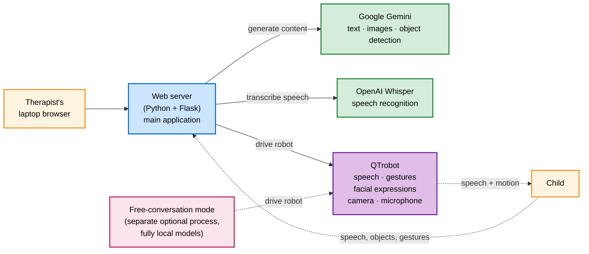

# QTrobot AI Therapy Assistant

A socially assistive robot platform for pediatric speech-language therapy. Built on the QTrobot humanoid robot, it lets therapists generate custom stories, quizzes, and conversational activities for each child — and then helps the robot deliver them with speech, gestures, and facial expressions.

## What is this?

QTrobot is a small humanoid robot made by LuxAI, with a screen for a face, two articulated arms, and a camera + microphone for sensing the world around it. This project turns the robot into an artificial-intelligence-powered therapy companion. A speech-language therapist sits at a laptop, opens a web dashboard, and uses it to:

- **Generate a custom story** for the child, complete with illustrations, robot gestures, and a short comprehension quiz at the end
- **Build a quiz** with yes/no or open-ended questions, with optional spoken answers
- **Run an object-detection game** where the child holds a toy up to the camera and the robot guesses what it is
- **Author a recovery routine** for moments when the child becomes distracted or overwhelmed (the robot calls their name, asks about a favorite toy, suggests a movement break)
- **Compose a structured back-and-forth conversation** on a theme like "greeting" or "weekend plans," paced by the child (a red card signals "I'm done speaking, your turn")

The robot reads everything aloud with synchronized mouth movements, plays matching arm gestures, changes its facial expression for each emotional beat in the story, and tracks the child's face with its head while listening.

## Who is it for?

- **Pediatric speech-language therapists** running clinical sessions with children aged roughly 3 to 12
- **Researchers** in human-robot interaction, especially in social robotics for children with autism and other developmental differences
- **QTrobot owners** who want a richer, artificial-intelligence-driven activity layer than the default sample programs

You don't need to be a roboticist to use the dashboard, but you do need access to a QTrobot to actually drive the hardware.

## What a typical session looks like

1. The therapist logs into the dashboard using a per-child account.
2. They pick an activity — for example, "generate a story about a brave fox."
3. The system reads the child's profile (age, learning goals, interests, any clinical persona notes) and asks Google Gemini to write a short, age-appropriate story.
4. Within seconds, the dashboard shows the draft story with inline tags telling the robot when to wave, smile, or look surprised. The therapist can edit and approve.
5. The system illustrates each scene of the story (Google Gemini Flash Image), splits the text into kid-sized pages, and writes a short multiple-choice quiz to check the child's understanding.
6. The child sits in front of the robot. The therapist taps "read story." The robot turns its head to follow the child, reads each page out loud, plays the matching gestures and facial expressions, and shows the scene illustration on the dashboard.
7. At the end, the dashboard presents the comprehension questions. The child answers by tapping a button — or by speaking, in which case OpenAI Whisper transcribes their answer.

Other activities follow the same pattern: the therapist authors content with the dashboard, the robot delivers it, and the system listens for the child's response.

## How it works at a glance

The project is two cooperating Python applications that drive the same physical robot:



The **web server** is the active therapist-facing application. It uses cloud artificial-intelligence models — primarily Google Gemini for content generation and OpenAI Whisper for speech recognition — to power every activity.

The **free-conversation mode** is a separate, optional process for open-ended chat. It runs entirely on local models (Ollama for the language model, NVIDIA Riva for speech recognition, LlamaIndex for retrieval over a local document collection) and is independent of the web server.

For the full architecture, see [ARCHITECTURE.md](ARCHITECTURE.md).

## What activities the robot supports

| Activity | What happens |
|----------|--------------|
| **Story telling** | The robot reads a custom illustrated story aloud with gestures and emotions, then quizzes the child |
| **Educational quiz** | Yes/no or open-ended questions; the child answers by tapping or speaking; the robot reacts with varied praise |
| **Scene game** | The child holds a toy up to the camera; the robot recognizes it and decides whether it matches the requested item |
| **Recovery activity** | Therapist-built routines the robot runs when a child needs to be re-engaged (calling their name, asking about their toy, suggesting a movement break) |
| **Conversation flow** | A structured back-and-forth on a chosen theme; the child uses a red card to signal they're done speaking |
| **Free conversation** *(separate process)* | Open-ended chat using fully local models with retrieval over project documents |

Step-by-step pipelines of each activity are documented in Section 15 of [ARCHITECTURE.md](ARCHITECTURE.md).

## Technology stack

**Hardware**

- QTrobot by LuxAI — humanoid robot with screen face, two arms, camera, microphone
- Robot Operating System (ROS) — middleware that exposes the robot's services

**Web application** (Python 3.8)

- Flask web server
- HTML templates for each activity surface (story reader, quiz player, drag-and-drop activity builders)

**Cloud artificial-intelligence services**

- **Google Gemini 2.5 Flash** — story generation, quiz generation, conversation follow-ups, post-processing of generated content
- **Google Gemini 2.5 Flash Image** — story illustrations and scene-game item cards
- **Google Gemini Robotics ER 1.5 Preview** — held-object detection for the scene game
- **OpenAI gpt-4o-transcribe** (Whisper) — speech recognition for every voice surface in the web server

**Local artificial-intelligence services** (only used by the optional free-conversation mode)

- **Ollama** running `gemma4:e4b` for conversation, `mxbai-embed-large` for document embeddings, and `moondream` for camera scene captioning
- **LlamaIndex** for retrieval-augmented generation over the project's document collection
- **NVIDIA Riva** with **Silero** voice-activity detection for speech recognition

**Text-to-speech**

- QTrobot's built-in Acapela engine with viseme-driven mouth synchronization (default)
- Amazon Polly with Pylips for lipsync (optional alternative)

## Quick start

### What you need

- A QTrobot (any current model with the standard Robot Operating System stack)
- A laptop on the same network as the robot
- A Google Cloud account with the Google Gemini service enabled
- An OpenAI account for Whisper
- *Optional:* an Amazon Web Services account if you want to use Polly text-to-speech instead of the built-in voice

### Install

The project uses **two Python virtual environments** because some libraries need Python 3.8 and others need Python 3.9.

```bash
# Web server (Python 3.8) — the main application
python3.8 -m venv .venv
source .venv/bin/activate
pip install -r requirements.txt

# Free-conversation mode (Python 3.9) — only if you want open-ended chat
python3.9 -m venv .venv39
source .venv39/bin/activate
pip install -r requirements.txt
```

Set your API keys (or put them in a `.env` file):

```bash
export OPENAI_API_KEY=sk-...
export GOOGLE_API_KEY=...
```

A full list of optional environment variables (Polly settings, Whisper tuning, robot connection details) is in Section 5.4 of [ARCHITECTURE.md](ARCHITECTURE.md).

### Run

**Web server — the main application:**

```bash
source .venv/bin/activate
python src/web_user_server.py
```

Then open your browser to `http://<robot-or-laptop-ip>:6060` and log in or register a child profile.

**Free-conversation mode — separate, optional:**

```bash
source .venv39/bin/activate
python3.9 src/qt_ai_data_assistant.py
```

This runs as a Robot Operating System node and needs the standard QTrobot Robot Operating System stack already running on the robot.

## Project structure

```
.
├── src/                          # Application code
│   ├── web_user_server.py        # Flask web server — main entry point
│   ├── qt_ai_data_assistant.py   # Free-conversation mode (Robot Operating System node)
│   ├── story_generator.py        # Story generation pipeline
│   ├── persona_rag.py            # Retrieves child personas to shape generated content
│   ├── tts_helper.py             # Text-to-speech wrapper
│   ├── whisper.py                # Speech recognition
│   ├── image_generator.py        # Story scene illustrations
│   ├── user_management.py        # Per-child account system
│   └── ...
├── scripts/                      # Python 3.9 worker scripts (called as subprocesses)
│   ├── gemini_story.py
│   ├── gemini_general.py
│   ├── gemini_analyze_image.py
│   └── ...
├── templates/                    # HTML pages — story reader, quiz player, activity builders
├── documents/                    # Reference documents used by retrieval and personas
├── config/default.yaml           # Configuration parameters
├── user_data/                    # Per-child data (created automatically at runtime)
├── ARCHITECTURE.md               # Full technical architecture (~1850 lines)
├── USER_MANAGEMENT_README.md     # Notes on the per-child account system
└── README.md                     # This file
```

## Where to go next

- **Want to understand how it all fits together?** Read [ARCHITECTURE.md](ARCHITECTURE.md). It covers every module, every model, every web route, and a step-by-step pipeline for each activity.
- **Want to know how child accounts work?** See [USER_MANAGEMENT_README.md](USER_MANAGEMENT_README.md).
- **Want to build a new activity?** Start by reading the existing routes in [src/web_user_server.py](src/web_user_server.py) and the corresponding pipeline diagrams in Section 15 of `ARCHITECTURE.md`.

## License

This project is released under the MIT License. See [LICENSE](LICENSE).
